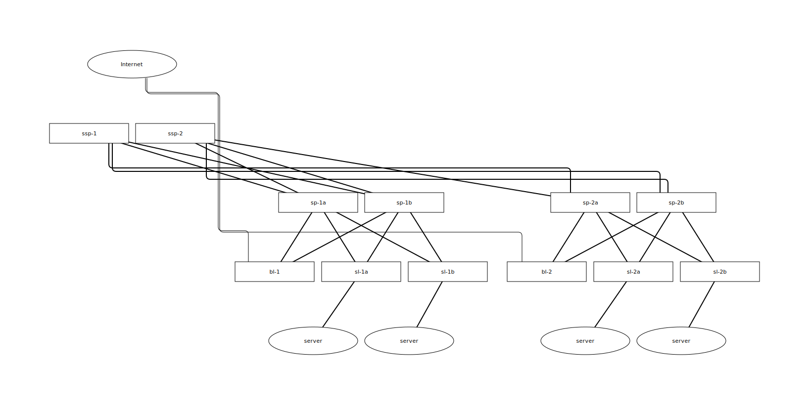
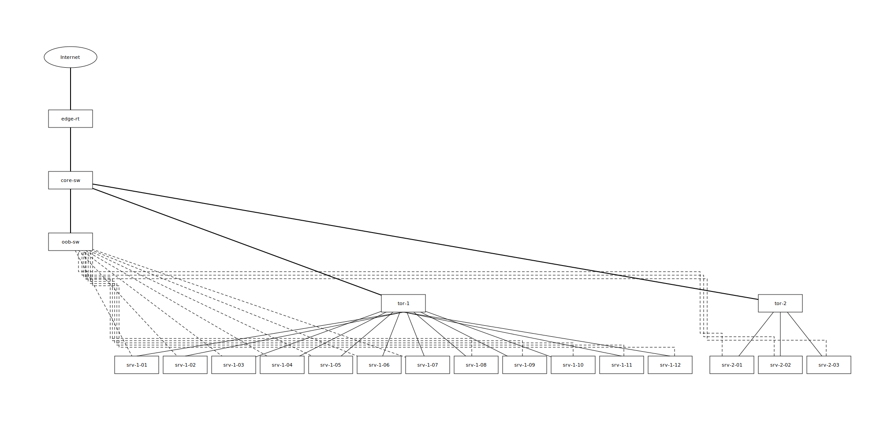

# netfig

netfig is a tool I developed based on my own experience. I
believe that network diagrams, like source code, are read and
maintained for far longer than the time required to create them.

Many tools exist for drawing network diagrams. netfig is not
trying to solve the same problem those tools solve; it is built
around a different goal — producing diagrams that are hard for
readers to misread and that stay consistent through repeated
edits. To reach that goal, netfig restricts what the writer can
express.

The constraint rules netfig applies are not my own invention.
They come from 萩原 学『ネットワーク図の描き方入門』(Nikkei BP,
2025). I read this book carefully, judged it a suitable basis
for the constraints, and adopted it as the reference.

## What the output looks like

A 5-stage Clos data-centre fabric (`examples/datacenter-fabric`):



A production rack at netfig's per-cell limit, with separated data
and out-of-band management networks (`examples/dense-cell`):



## Quick start

```
netfig topology.yaml > diagram.svg
```

A minimal `topology.yaml`:

```yaml
legend:
  symbols:
    firewall: { shape: rect }
    switch:   { shape: rect }
    host:     { shape: ellipse }

layout:
  bands:
    - name: edge
      roles: [firewall]
    - name: core
      roles: [switch]
    - name: access
      roles: [host]
  locations:
    site: "0"

nodes:
  - { id: fw, role: firewall, location: site }
  - { id: sw, role: switch,   location: site }
  - { id: pc, role: host,     location: site }

links:
  - { from: fw, to: sw }
  - { from: sw, to: pc, label: lan }
```

## Where to read next

- [examples/](examples/) — five operational topologies (HA firewall
  pair, RFC 7938 Clos fabric, ISP backbone, dense rack, multi-tier
  ISP). Read these first.
- [docs/USAGE.md](docs/USAGE.md) — YAML field reference, command-line
  flags, and the validation error catalogue.
- [docs/DESIGN.md](docs/DESIGN.md) — why netfig is shaped the way
  it is, and where it does not fit.
